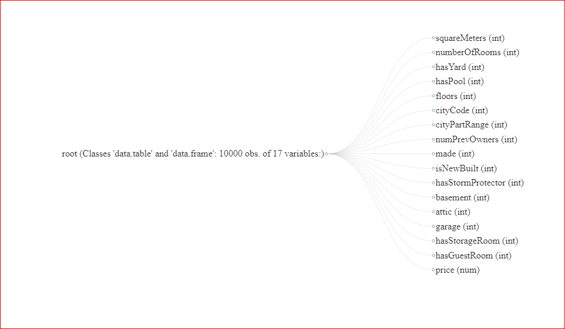
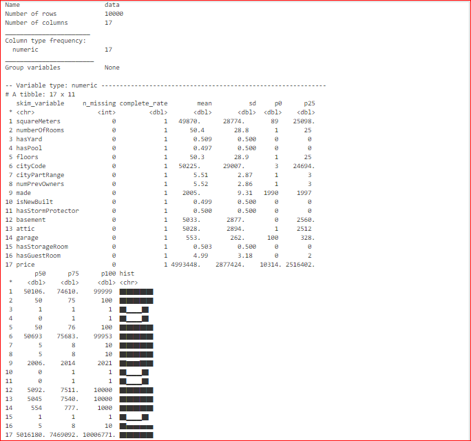
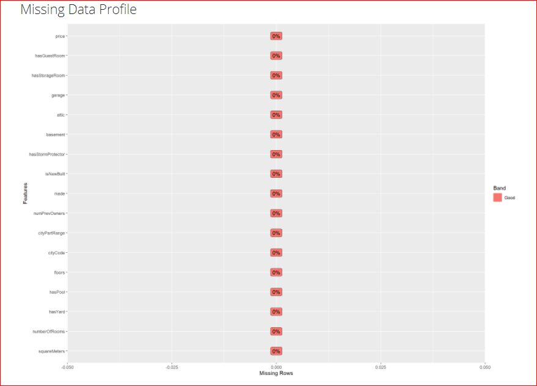
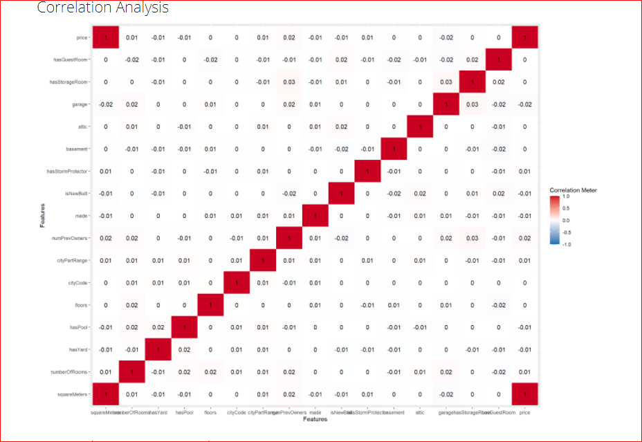

# POC-Rstudio


# Contexte du projet: 


```
Le jeu de données proposé est celui des ventes de immeubles sur Paris. Il est parfait pour faire un POC technologique, c'est à dire, utiliser R pour un modèle prédictif. 
Le but est donc de créer un modèle et de visualiser les résultats avec R pour vous faire une idée de ce que permet ce langage. Ainsi, vous pourrez voir la différence avec Python.

Vous pouvez, par exemple, préparer un modèle pour estimer les prix de l'immobilier sur Paris.
```


# Déroulé de l'étude :

Pour cette étude , nous allons
-   visualiser les données
-   analyser les données  et chercher s'il existe une relation entre elles afin de définir le choix du modèle que nous utiliserons
-   construire notre modèle
-   visualiser le résultat attendu

Langage et  outils utilisés:

  - **R** : langage orienté vers le traitement de données et l’analyse statistique dérivé du langage S
  - **Rstudio** : environnement de développement intégré qui permet de travailler en R, développer de nouvelles bibliothèques et travailler avec des notebooks.
  - **Shiny** : package R qui facilite la création d'applications Web interactives directement à partir de R. Nous pouvons héberger des applications autonomes sur une page Web ou les intégrer dans des documents R Markdown ou créer des tableaux de bord . 


# Visualisation des données :

[Notre jeu de données](https://github.com/patlemoal/POC-Rstudio/blob/85bb579e5cfce50edbea83fba3d632287ca51d1c/data/prices.csv) est constitué de  17 variables et 10 000 lignes. 


Ci dessous les 17 variables qui le compose :




# Analyse des données :

L'ensemble de l'analyse est accessible via le lien suivant : [test (1).Rmd](![image]analyse/test (1).Rmd)







Nous voyons bien que la correlation est liée  la surface et au prix.


A noter : 
L’extension DataExplorer fournit des outils d’exploration graphique d’un fichier de données. En premier lieu, sa fonction create_report génère un rapport automatique à partir d’un tableau de données.

L'ensemble de l'étude est visible https://github.com/patlemoal/POC-Rstudio/blob/ad31b66be373945e3b304555cbb36a39ee4365d6/Data%20Profiling%20Report.html


# Construction du modèle: 


Nous allons donc étudier la relation entre la target (price) et la variable explicative SquareMeters (surface).


# Visualisation du résultat:


# Comparaison R vs python:


