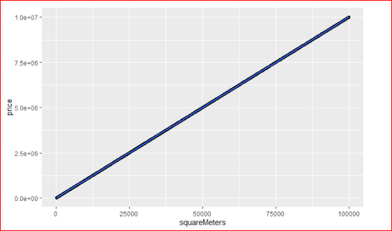

# POC-Rstudio (en cours)


# Contexte du projet: 


```
Le jeu de données proposé est celui des ventes de immeubles sur Paris. Il est parfait pour faire un POC technologique, c'est à dire, utiliser R pour un modèle prédictif. 
Le but est donc de créer un modèle et de visualiser les résultats avec R pour vous faire une idée de ce que permet ce langage. Ainsi, vous pourrez voir la différence avec Python.

Vous pouvez, par exemple, préparer un modèle pour estimer les prix de l'immobilier sur Paris.
```


# Déroulé de l'étude :

Pour cette étude , nous allons
-   visualiser les données
-   analyser les données  et chercher s'il existe une relation entre elles afin de définir le choix du modèle que nous utiliserons
-   construire notre modèle
-   visualiser le résultat attendu

Langage et  outils utilisés:

  - **R** : langage orienté vers le traitement de données et l’analyse statistique dérivé du langage S
  - **Rstudio** : environnement de développement intégré qui permet de travailler en R, développer de nouvelles bibliothèques et travailler avec des notebooks.
  - **Shiny** : package R qui facilite la création d'applications Web interactives directement à partir de R. Nous pouvons héberger des applications autonomes sur une page Web ou les intégrer dans des documents R Markdown ou créer des tableaux de bord . Une caractéristique essentielle de Shiny est que ces applications sont en quelque sorte « live » puisque la sortie de la page Web change au fur et à mesure que l'utilisateur modifie les entrées, sans recharger le navigateur
  
  Shiny contient deux paramètres fondamentaux, l'interface utilisateur et le serveur. 

  **L'interface utilisateur (UI)** contient tout le code texte qui décrit la mise en page de la page, tout texte supplémentaire, images et autres éléments HTML que nous          souhaitons inclure afin que l'utilisateur puisse interagir et comprendre comment utiliser la page Web. 

  **Le serveur** est le back-end de l'application Shiny. Ce paramètre crée un serveur Web spécialement conçu pour héberger des applications Shiny dans un environnement contrôlé.


# Visualisation des données :

[Notre jeu de données](https://github.com/patlemoal/POC-Rstudio/blob/85bb579e5cfce50edbea83fba3d632287ca51d1c/data/prices.csv) est constitué de  17 variables et 10 000 lignes. 


Ci dessous les 17 variables qui le compose :


# Analyse des données :

L'ensemble de l'analyse est accessible via le lien suivant : [test (1).Rmd](![image]analyse/test (1).Rmd)


{:height="36px" width="36px"}

{:height="36px" width="36px"}

<p align="center">
  
  
  
</p>


Nos données sont toutes numériques et nous n'avons pas de données manquantes.





Uniquement, deux variables sont corrélées (et fortement à 99%) : 
  SquareMeters et Price. 
Il s'agit d'un problème de régression linéaire.

A noter : 
L’extension DataExplorer fournit des outils d’exploration graphique d’un fichier de données. En premier lieu, sa fonction create_report génère un rapport automatique à partir d’un tableau de données.

L'ensemble de l'étude est visible https://github.com/patlemoal/POC-Rstudio/blob/ad31b66be373945e3b304555cbb36a39ee4365d6/Data%20Profiling%20Report.html


# Construction du modèle: 


Nos 2 variables :  target (price) et  SquareMeters (surface) étant corrélées, le choix du modèle est simple et limpide : régression linaire


# Visualisation du résultat:

Nous visualisons nos données via shinny.


  - 


# Comparaison R vs python:


